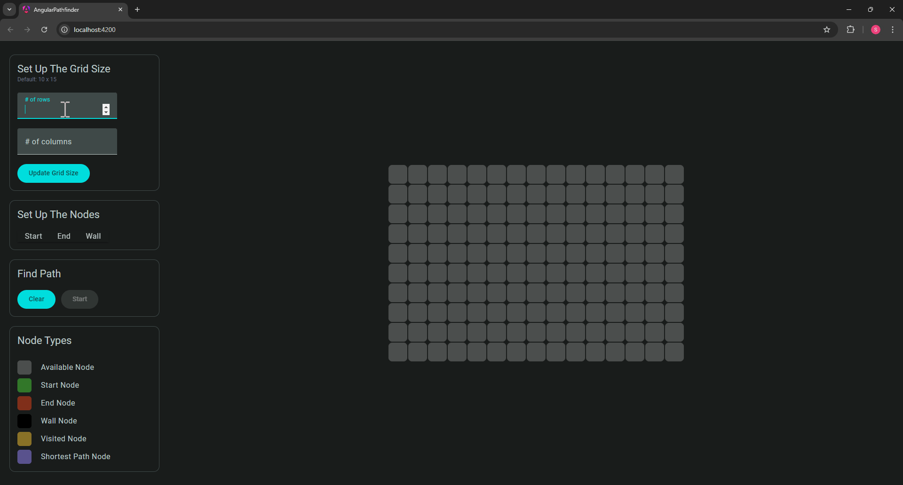

# 🧭 Waypoint Wizard

**Waypoint Wizard** is an interactive Angular application that demonstrates and visualizes the **A\* Search Algorithm** for pathfinding. It allows users to build customizable grid maps, define start/end points, place obstacles, and watch the algorithm find the optimal route.

---

## ✨ Features

- 🔧 Adjustable grid size
- 🟢 Set a **start node** and 🔴 an **end node**
- 🧱 Place **wall nodes** to simulate obstacles
- 🔄 Reset the grid and restart the simulation
- 🚀 Visualize the optimal path from start to end using **A\* Search**

---

## 🧠 Data Structures Used

- **Array** – to represent the grid and its nodes
- **Min Heap** – to efficiently retrieve the next node with the lowest `f-cost`

---

## 🔍 A\* Search Algorithm Implementation

1. **Initialize the Grid:**  
   Create a grid of size `n × m`.

2. **User Setup:**  
   Let the user define:
  - Start node
  - End node
  - Wall nodes (impassable)

3. **Cost Calculations (Manhattan Distance):**  
   For each node, calculate:
  - `g-cost`: Distance from the **start node**
  - `h-cost`: Estimated distance to the **end node**
  - `f-cost`: `g-cost + h-cost`

4. **Search Algorithm:**
  - Start from the start node.
  - Evaluate neighbors (up, down, left, right — no diagonals).
  - Add valid neighbors to a **min heap** prioritized by `f-cost`.

5. **Pathfinding Loop:**
  - Pop the node with the lowest `f-cost` from the heap.
  - Set it as the current node.
  - Repeat until the **end node** is reached.

6. **Path Reconstruction:**
  - Once the end node is reached, backtrack to the start node using parent references.
  - Visualize the path step-by-step for the user.

---

## 🛠 Tech Stack

---

## 🎬 Demo

---

## 📌 Notes

This project is a great educational tool to:
- Understand how A\* pathfinding works
- Visualize heuristic-driven graph traversal
- Explore front-end algorithm animations using Angular
